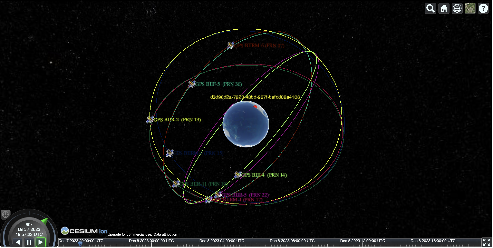
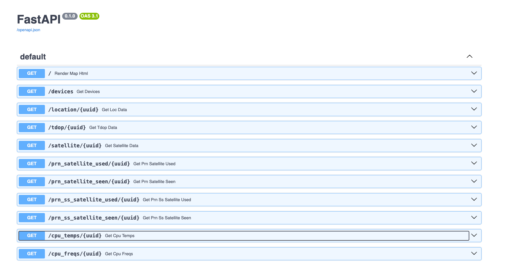

# Immersive 3D Visualization: Unveiling the Mystique of GNSS and the Satellites that Power them

This repository holds scripts to pull GNSS and satellite data and store it in a datbabase for historical data and currently active device data. It also has an API for the cesiumjs frontend to create the 3D visualization with live satellite orbits and the gps current location. Many GNSS receivers can be connected all over the world at the same time. You can see graphs in the frontend for device cpu temperatures and more.


### Components:
- Backend
    - MySQL
    - Python
    - FastAPI
- Frontend
    - HTML/CSS
    - JavaScript
    - CesiumJS
    - ChartJS


## Goal
Our goal is to show what your GNSS receiver is connected to behind-the-scenes and how satellite position can affect time accuracy (TDOP) and satellite signal strength. Goal is also to figure out what is the ideal satellite combination depending on their respective positions using the TDOP and satellite signal strength metric.
Show pic of working gps with satellites its using and their strengths

## Description
This is a semester long project for IE 421 - High Frequency Trading Technology instructed by Professor David Lariviere.

## Teammates
Akash Sannasi
- I'm an undergraduate student at the University of Illinois Urbana-Champaign studying Computer Science + Economics. I've taken courses in database systems, applied machine learning, computer systems, and algorithms. I have previous internship experience in sensor data collection (GPS, RTSP cameras, microphones, etc.) and backend/full-stack applications using that data. My skills include being advanced at Python, C++, SQL, JavaScript, and React. 

You can reach me at: <br/>
Gmail: akashsan522@gmail.com <br/>
LinkedIn: https://www.linkedin.com/in/-akash-s/

Harshda Ghai
- I'm an undergraduate student at the University of Illinois Urbana-Champaign studying Computer Science. I am graduating in May 2024, and have taken courses in Data Structures, System Programming, Database Management Systems, Artificial Intelligence, and IOT. I have previous internship experience working as a Software Engineering Intern for Mettl | Mercer and have worked in a startup for my previous internship. My skills include Python, Java, C++, SQL. My interest areas include - AI/ML Algorithms and IOT.

You can reach me at: <br/>
Email : hghai2@illinois.edu <br/>
LinkedIn: https://www.linkedin.com/in/harshda-ghai-3853b3187 


Ananya Agarwal
- I am an undergraduate student studying Computer science at the University of Illinois at Urbana Champaign. I am going to graduate may 2024. I have 
taken courses in database Management systems, Artificial Intellifence, statistics for Computer Science, System programming,Algorithms and data structures and IOT. I have experince working as a software development intern at Tesla and Ericsson. My skills include python, Java, CSS, C#, HTML, Javascript, C++.

You can reach me at: <br/>
Linkedin : https://www.linkedin.com/in/ananya-agarwal-407196205/


Vashishth Goswami
- I'm an undergrad student at the University of Illinois Urbana-Champaign, graduating in May 2024. I have taken courses like Intro. to Algorithms and models of computations, System Programming, Artificial Intelligence. I have worked for NASA Lunabotics Competition where I helped with automation and GUI interface for controls. My skills include Python, Java, C++, Ocaml. Following my interest in systems, I want to work in Cryptography, Architecture and Math.

You can reach me at: <br/>
Email : vgosw2@illinois.edu <br/>
LinkedIn: https://www.linkedin.com/in/vashishth8/ 


## Visuals







## Installation
- Install Libraries: 
    - ```pip3 install -r requirements.txt```
- Setup MySQL instance and .env file
- Run Database Setup file
    - ```python3 db_setup.py```
- Run Project (api service + GNSS receiver data collection + frontend) 
    - run ```./run_gps_api.sh```

## Usage
- Need a .env file with your mysql database credentials
- Obtain device with a GNSS reciever with an active fix and running GPSD
- On running the backend your device
    - automatically registers itself to MySQL 
    - uploads data to our MySQL instance
- On shutting down the backend
    - device unregisters from active devices table on MySQL
    - device stays recorded in the connected_devices_history table
- The CesiumJS frontend uses the data to populate the globe with device locations and satellites in real-time
- ChartJS charts are displayed
    - cpu temperatures over time
    - cpu frequency over time
    - TDOP (time dilution of precision) over time
    - current satellite signal strength

### Features
1. 3D Visualization of gps locations on the Earth
2. Satellites orbitting the Earth in real-time
3. See what satellites your gps device is using
4. Click on device location or name to be redirected to generated graphs of cpu-temp, cpu-freq, TDOP (time dilution of precision), and used satellite PRN and their satellite strengths
### Testing
- run ```./run_gps_api.sh```
- Navigate to the FastAPI docs ```http://127.0.0.1:5003/docs```

## Changes from Project Proposal
- Initial plans of restricting GNSS and switch GNSS constellation automatically if massive spike in latency scrapped. This is because there is not an ideal way to measure latency other than using TDOP and satellite strength. We also realized the receiver automatically switches if necessary and ublox commands already exist to restrict GNSS constellations
- Research on whether latency is improved on just one satellite connected vs. multiple are connected at a time scrapped because we didn't have a good way of measuring latency
- Our focus changed to satellite signal strength and TDOP instead in regards to the importance of time in HFT
- Left out NATS to simplify data transfer between the frontend and backend to FastAPI
- Ublox already has a time mode for being able to make pis have a static location after 10 seconds (average locations) then turn off the location just for timestamp


## Support
#### Installing gpsd
- https://gpsd.gitlab.io/gpsd/installation.html

#### Satellite data that can be read through NMEA 
- https://gpsd.gitlab.io/gpsd/gpsd_json.html

#### Accessing api swagger docs
- visit the api url + /docs

#### Python 3 parser for the UBX © protocol. UBX is a proprietary binary protocol implemented on u-blox ™ GNSS/GPS receiver modules.
- https://github.com/semuconsulting/pyubx2

#### Setting up pi MySQL instance
- https://pimylifeup.com/raspberry-pi-mysql/

#### TLE Data used for Satellites
- https://github.com/kujosHeist/tle2czml

## Roadmap for Future Ideas
- Use tools like Prometheus, Grafana, or commercial monitoring solutions to gain insights into your system's health on the frontend
- Implement ublox command sending from the UI and see satellite changes in real time
- Time lapse slider to see satellite strength over time and when a device switches satellites
- Add airplanes
- Add radio waves
- data centers
- Adding testing for health data and to signal when a raspberry pi is down what to do
- Correlate satellites with their country, year made, and etc…
- Command to restrict a certain constellation through the UI using ublox commands
- local weather
- User notifications when satellite signal strength or TDOP is unideal
- Detect trucker GPS jamming and alert the user about latency issue

## Project status
- API/backend established with registering/inserting/fetching routes complete
- Local MySQL instance done
- Frontend includes all U.S. Satellites currently (31)
- Displays currently connected devices
- On click you can see charts of that device's data, but does not live update unless you reload
- Needs asynchronous reloading and data fetching


