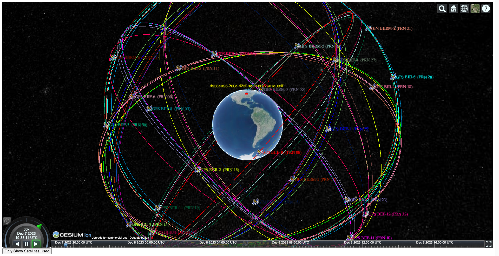
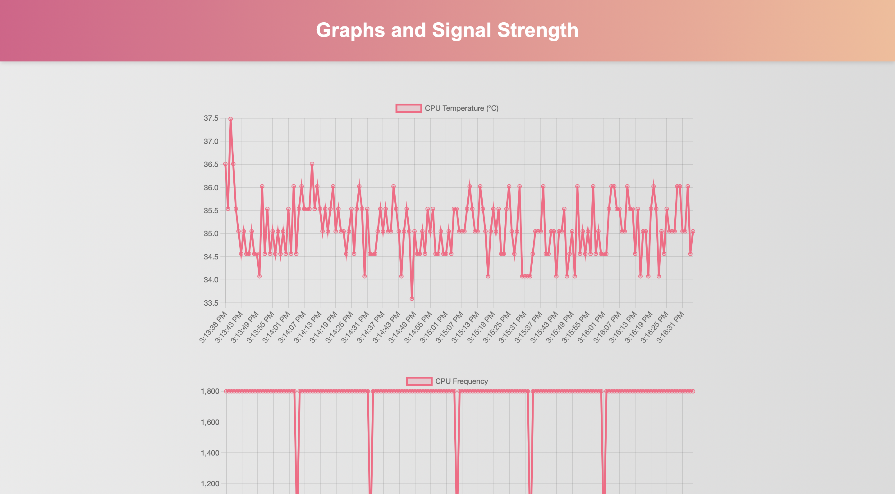
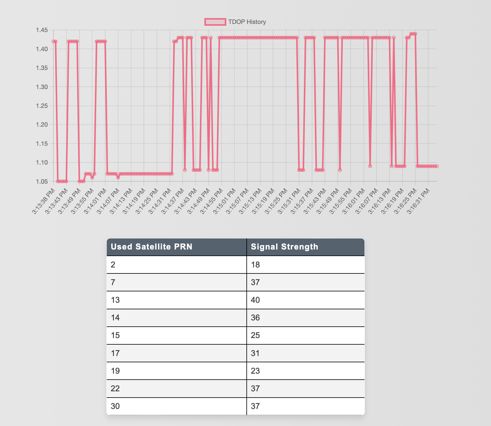
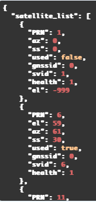
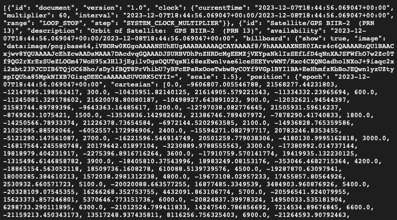

# GPS-Satellite 3D Visualization: Finding Optimal Satellites and Positioning for Time Accuracy

## Team
Akash Sannasi - Team Lead
- I'm an undergraduate student at the University of Illinois Urbana-Champaign studying Computer Science + Economics graduating May 2025. I've taken courses in database systems, applied machine learning, computer systems, and algorithms. I have previous internship experience in sensor data collection (GPS, cameras, microphones, etc.) and backend/full-stack applications powered by that data. My skills include being advanced at Python, C++, SQL, JavaScript, and React. 

You can reach me at: <br/>
Gmail: akashsan522@gmail.com <br/>
LinkedIn: https://www.linkedin.com/in/-akash-s/

Harshda Ghai
- I'm an undergraduate student at the University of Illinois Urbana-Champaign studying Computer Science. I am graduating in May 2024, and have taken courses in Data Structures, System Programming, Database Management Systems, Artificial Intelligence, and IOT. I have previous internship experience working as a Software Engineering Intern for Mettl | Mercer and have worked in a startup for my previous internship. My skills include Python, Java, C++, SQL. My interest areas include - AI/ML Algorithms and IOT.

You can reach me at: <br/>
Email : hghai2@illinois.edu <br/>
LinkedIn: https://www.linkedin.com/in/harshda-ghai-3853b3187 


Ananya Agarwal
- I am an undergraduate student studying Computer science at the University of Illinois at Urbana Champaign. I am going to graduate may 2024. I have 
taken courses in database Management systems, Artificial Intellifence, statistics for Computer Science, System programming,Algorithms and data structures and IOT. I have experince working as a software development intern at Tesla and Ericsson. My skills include python, Java, CSS, C#, HTML, Javascript, C++.

You can reach me at: <br/>
Linkedin : https://www.linkedin.com/in/ananya-agarwal-407196205/


Vashishth Goswami
- I'm an undergrad student at the University of Illinois Urbana-Champaign, graduating in May 2024. I have taken courses like Intro. to Algorithms and models of computations, System Programming, Artificial Intelligence. I have worked for NASA Lunabotics Competition where I helped with automation and GUI interface for controls. My skills include Python, Java, C++, Ocaml. Following my interest in systems, I want to work in Cryptography, Architecture and Math.

You can reach me at: <br/>
Email : vgosw2@illinois.edu <br/>
LinkedIn: https://www.linkedin.com/in/vashishth8/ 


## Project

## Description
This is a semester long project for IE 421 - High Frequency Trading Technology instructed by Professor David Lariviere. This repository holds scripts to pull GNSS and satellite data and store it in a datbabase for historical data and currently active device data. It also has an API for the cesiumjs frontend to create the 3D visualization with live satellite orbits and the gps current location. Many GNSS receivers can be connected all over the world at the same time. You can see graphs in the frontend for device cpu temperatures and more.


### Components:
- Backend
    - MySQL
    - Python
    - FastAPI
- Frontend
    - HTML/CSS
    - JavaScript
    - CesiumJS
    - ChartJS
- Hardware
    - HiLetgo NEO-7M GPS Satellite Positioning Module
    - Rasberry Pi 4 (8GB)


## Goal
Our goal is to show what your GNSS receiver is connected to behind-the-scenes and how satellite position can affect time accuracy (TDOP) and satellite signal strength. Goal is also to figure out what is the ideal satellite combination depending on their respective positions using the TDOP and satellite signal strength metric. We want to determine which satellites at what positions cause the lowest time error measured by TDOP.


## Visuals







## Technical Details

### What is GPS and GNSS?

#### Global Positioning System (GPS):

GPS is a satellite-based navigation system that enables users to determine their precise location and track movements on Earth. The system consists of a constellation of satellites orbiting the Earth, ground control stations, and GPS receivers. Here's how it works:
 
1. Satellite Constellation: 
The GPS constellation consists of a group of satellites that orbit the Earth.
2. Triangulation: 
The GPS receiver on the ground communicates with multiple satellites simultaneously. By measuring the distance (range) between the receiver and each satellite based on the time it takes for signals to travel, the receiver can calculate its exact location using a process called trilateration.
3. Navigation Solution: 
The GPS receiver processes the data received from the satellites and calculates the user's latitude, longitude, altitude, and sometimes velocity. This information provides accurate positioning anywhere on Earth.
3. Time Synchronization: 
Precise timing is crucial for GPS. The satellites and receivers synchronize their clocks, and the receiver uses the time delay of signals to determine the distance to each satellite.

#### Global Navigation Satellite System (GNSS):

GNSS is a more encompassing term that refers to a collection of satellite navigation systems beyond GPS. While GPS is a specific system developed by the United States, GNSS includes other systems developed by different countries or organizations. Examples include:

1. GPS (United States): The most well-known and widely used system.
2. GLONASS (Russia): A Russian satellite navigation system.
3. Galileo (European Union): The European Union's global navigation system.
4. BeiDou (China): The Chinese satellite navigation system.

GNSS involves dealing with a diverse range of satellite signals, protocols, and data formats. GNSS receivers are designed to be compatible with multiple satellite constellations, and algorithms must be adaptable to handle signals from different systems, optimizing the use of available satellites to enhance accuracy and reliability.

GPS is essentially specific satellite navigation system, and GNSS is the broader term that encompasses multiple global navigation systems, each contributing to the field of satellite-based positioning.

#### How a satellite navigation receiver works
Let's delve into the intricacies of how a satellite navigation receiver, such as a GPS receiver, utilizes signals from multiple satellites to calculate time, location, and other parameters from a computer science perspective.

1. Signal Acquisition:

When a GPS receiver is powered on, it starts by searching for signals from multiple satellites in view. Each satellite transmits signals containing information about its location and the current time.

2. Time Synchronization:

Accurate timekeeping is fundamental to GPS. The receiver needs to synchronize its clock with the clocks on the satellites. Each satellite signal includes a timestamp, and the receiver compares the arrival times of signals from different satellites to calculate the time delay or range to each satellite. Therefore, a GPS receiver uses more than one satellite, usually 4, to provide 3D location and accurate time data. 

3. Trilateration:

Trilateration is the mathematical technique used to determine the receiver's location. By knowing the distance (range) from the receiver to each satellite, the receiver can establish its position by finding the intersection point of spheres centered around each satellite. In a 2D scenario, this intersection point forms a circle; in 3D, it forms a sphere.


4. Multilateration and Optimization:

In practice, GPS receivers often use a technique called multilateration, which extends trilateration to incorporate measurements from more than three satellites. This helps compensate for additional sources of error and improves accuracy. Optimization algorithms, such as least squares estimation, are commonly used to find the best-fit position solution by minimizing the overall error.


5. Continuous Tracking and Dynamic Solutions:

GPS receivers continuously track signals from multiple satellites to update the position and refine the solution over time. In dynamic scenarios, where the receiver is in motion, algorithms must adapt to changes in velocity, acceleration, and environmental conditions. We hope to add environmental conditions in our project in the future to showcase how weather can affect TDOP and satellite signal strength. 


6. Error Mitigation:

To enhance accuracy, the receiver must account for various errors, such as atmospheric delays, clock inaccuracies, and geometric dilution of precision (GDOP). In our project we use the time dilution of precision (TDOP) to identify satellite combinations at certain positions that provide the lowest time error. 

### Data collected from the receiver


- *uuid*: Unique id to identify a device with a working gps receiver.
- *time*: Number of satellites used in navigation solution.
- *longitude*: Longitude in degrees: +/- signifies East/West.
- *latitude*: Latitude in degrees: +/- signifies North/South.
- *altitude*: altitude of the gps receiver.
- *mode*: NMEA mode: 0=unknown, 1=no fix, 2=2D, 3=3D.
- *nSat*: Number of satellite objects in "satellites" array.
- *uSat*: Number of satellites used in navigation solution.
- *TDOP*: Time dilution of precision, a dimensionless factor which should be multiplied by a base UERE to get an error estimate. UERE is the user equivalent range error (UERE) which refers to the error of a component in the distance from receiver to a satellite.
- *satellites*: List of satellite objects and thair data in skyview by the GNSS receiver
    - 
- *cpu_temp*: cpu temperature of the device in Celsius.
- *cpu_freq*: cpu frequency of the device in Hz.

See https://gpsd.gitlab.io/gpsd/gpsd_json.html for more in depth explanations


### Satellites and their Real-Time Orbits
- We use pre-determined real-time data of a satellite's orbit using TLE data. 
- A TLE is a data format encoding a list of orbital elements of an Earth-orbiting object for a given point in time.
- CZML is a JSON format for describing a time-dynamic graphical scene, primarily for display in a web browser running Cesium.
- We used the tle2czml library to return czml files to power our CesiumJS 3D visualization's real-time satellites orbits. 
    -  https://github.com/kujosHeist/tle2czml 
- The TLE data we used can be found on https://celestrak.org/NORAD/elements/

- Example of TLE data


- After conversion to CZML data


## Installation
- Install Libraries: 
    - ```pip3 install -r requirements.txt```
- Setup MySQL instance and .env file
- Run Database Setup file
    - ```python3 db_setup.py```
- Run Project (api service + GNSS receiver data collection + frontend) 
    - run ```./run_gps_api.sh```

## Usage
- Need a .env file with your mysql database credentials
- Obtain device with a GNSS reciever with an active fix and running GPSD
- On running the backend your device
    - automatically registers itself to MySQL as an active device
    - 
    - uploads data to the gps_data table
    - 

- On shutting down the backend
    - device unregisters from active devices table on MySQL
    - device stays recorded in the connected_devices_history table
- The CesiumJS frontend uses the data to populate the globe with device locations and satellites in real-time
- ChartJS charts are displayed
    - cpu temperatures over time
    - cpu frequency over time
    - TDOP (time dilution of precision) over time
    - current satellite signal strength

### Features
1. 3D Visualization of gps locations on the Earth
2. Satellites orbitting the Earth in real-time
    - Note: Satellite data before toggling show satellites used is from both sides of the earth is predefined orbit data. We are not getting any data about the satellite orbit from the gps chip, only info on what specific satellites the gps receiver is using.
3. See what satellites your gps device is using
4. Click on device location or name to be redirected to generated graphs of cpu-temp, cpu-freq, TDOP (time dilution of precision), and used satellite PRN and their satellite strengths
### Testing
- run ```./run_gps_api.sh```
- Navigate to the FastAPI docs ```http://127.0.0.1:5003/docs```

## Changes from Project Proposal
- Initial plans of restricting GNSS and switch GNSS constellation automatically if massive spike in latency scrapped. This is because there is not an ideal way to measure latency other than using TDOP and satellite strength. We also realized the receiver automatically switches if necessary and ublox commands already exist to restrict GNSS constellations
- Research on whether latency is improved on just one satellite connected vs. multiple are connected at a time scrapped because we didn't have a good way of measuring latency
- Our focus changed to satellite signal strength and TDOP instead in regards to the importance of time in HFT
- Left out NATS to simplify data transfer between the frontend and backend to FastAPI
- Ublox already has a time mode for being able to make pis have a static location after 10 seconds (average locations) then turn off the location just for timestamp


## Support
#### Installing gpsd
- https://gpsd.gitlab.io/gpsd/installation.html

#### Satellite data that can be read through NMEA 
- https://gpsd.gitlab.io/gpsd/gpsd_json.html

#### Accessing api swagger docs
- visit the api url + /docs

#### Python 3 parser for the UBX © protocol. UBX is a proprietary binary protocol implemented on u-blox ™ GNSS/GPS receiver modules.
- https://github.com/semuconsulting/pyubx2

#### Setting up pi MySQL instance
- https://pimylifeup.com/raspberry-pi-mysql/

#### TLE Data used for Satellites
- https://github.com/kujosHeist/tle2czml

## Roadmap for Future Ideas
- Use tools like Prometheus, Grafana, or commercial monitoring solutions to gain insights into your system's health on the frontend
- Implement ublox command sending from the UI and see satellite changes in real time
- Time lapse slider to see satellite strength over time and when a device switches satellites
- Add airplanes
- Add radio waves
- data centers
- Adding testing for health data and to signal when a raspberry pi is down what to do
- Correlate satellites with their country, year made, and etc…
- Command to restrict a certain constellation through the UI using ublox commands
- local weather
- User notifications when satellite signal strength or TDOP is unideal
- Detect trucker GPS jamming and alert the user about latency issue

## Project status
- API/backend established with registering/inserting/fetching routes complete
- Local MySQL instance done
- Frontend includes all U.S. Satellites currently (31)
- Displays currently connected devices
- On click you can see charts of that device's data, but does not live update unless you reclick
- Needs asynchronous reloading and data fetching
- Ublox support still in works and development stopped to work on other features (see ublox branch)


